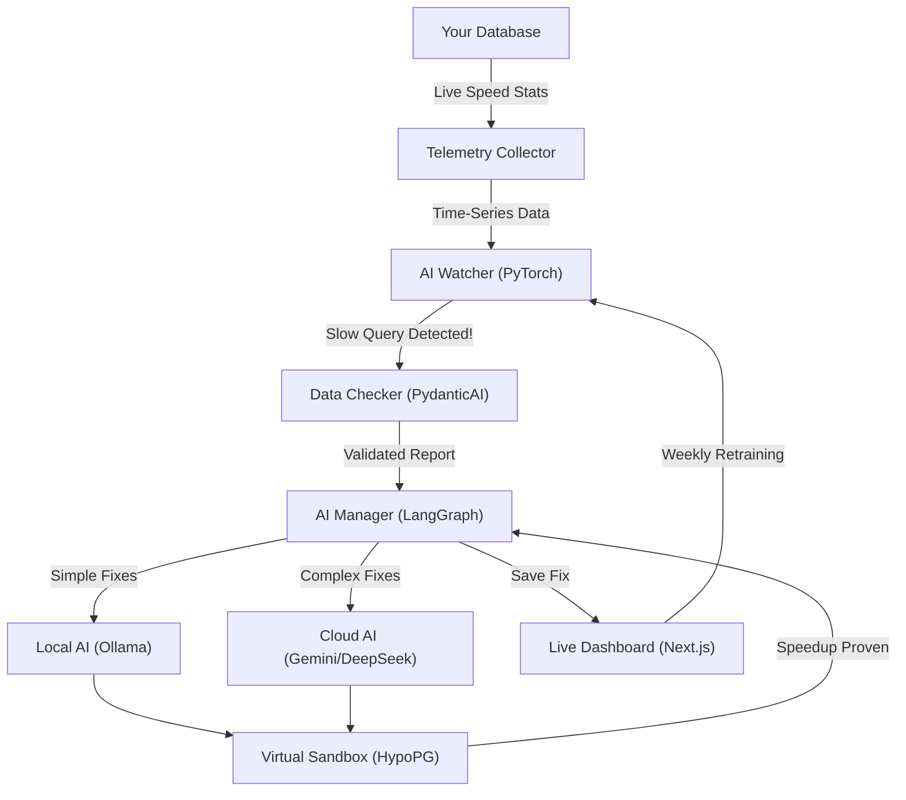

#  Project Apex

### Autonomous Database Performance Tuning & Guardrail Engine

Project Apex is a fully autonomous **AIOps (Artificial Intelligence for IT Operations)** pipeline designed to solve one of the most expensive and complex problems in software engineering: **unoptimized database queries**. 

Instead of waiting for users to complain about slow dashboards or waiting for DBAs to manually run `EXPLAIN` on production databases, Project Apex acts as an autonomous AI Database Administrator that works 24/7.

---

## 💡 What exactly does it do? (In Easy Words)

Imagine your database is a busy restaurant kitchen. 
1. **The Watcher:** Project Apex acts like a kitchen manager constantly watching how long it takes to cook meals (database queries).
2. **The Alarm:** If a specific meal suddenly starts taking 10x longer to cook than it normally does, the manager sounds an alarm.
3. **The AI Chef:** An Artificial Intelligence (Ollama / Gemini) is immediately called in. It looks at the recipe (SQL query) and figures out a shortcut to cook it faster (like building a new database index).
4. **The Sandbox Test:** Before telling the actual cooks to change the recipe, the AI simulates the shortcut in a virtual sandbox to prove mathematically that it works and won't ruin the kitchen.
5. **The Fix:** If it works, it saves the fix and reports it to your live Dashboard. Over time, the AI automatically studies these fixes to get even smarter!

---

## 🧪 How to Test This App

Once the Python Daemon (`python daemon.py`) and Next.js Dashboard (`npm run dev`) are both running, your dashboard will likely sit quietly because your database is currently healthy! 

To force the AI to spring into action, open a new PowerShell terminal and run this command to inject a **fake slow query** into the system:

```powershell
Invoke-RestMethod -Uri http://localhost:8000/api/trigger -Method Post -ContentType "application/json" -Body '{"query": "SELECT * FROM orders JOIN customers ON orders.customer_id = customers.id", "baseline_exec_ms": 10.0, "current_exec_ms": 850.0}'
```

Watch your `http://localhost:3000` dashboard! You will see the AI detect the anomaly, rewrite the query, propose an index, and simulate the speedup live on your screen.

---

## 🏗️ Architecture Flowchart



---

## 🛠️ Tech Stack & Features

| Layer | Technology | Key Features |
|-------|-----------|--------------|
| **Deep Learning** | PyTorch BiLSTM | Trained locally on the Kaggle NAB dataset. Uses Mixed Precision (AMP) and gradient accumulation to run flawlessly on 4GB VRAM (RTX 3050). |
| **Validation** | PydanticAI | Forces the AI agents to strictly return structured JSON payloads to prevent pipeline crashes. |
| **Orchestration** | LangGraph | A state machine that manages the logic of routing, reasoning, executing, verifying, and logging. |
| **Reasoning (Local)** | Ollama | Runs `qwen2.5-coder:1.5b` locally for zero-latency, highly-secure SQL optimization. |
| **Reasoning (Cloud)**| LangChain Fallbacks | A highly resilient free-tier fallback chain. If a query is too complex, it escalates to **Gemini 2.5 Flash**, falls back to **Groq (Llama 3.3 70B)**, and finally **OpenRouter (DeepSeek R1)**. |
| **Safe Validation** | MCP + HypoPG | The AI tests its indexes using the official PostgreSQL `HypoPG` extension over an isolated RBAC connection, guaranteeing production data is never touched or cloned. |
| **Dashboard** | Next.js 15 | A gorgeous, real-time tracking interface built with Recharts, React 19, and TailwindCSS. |

---

## 🚀 Quick Start Guide

### 1. Requirements & Setup
- **Hardware:** NVIDIA GPU with 4GB+ VRAM (RTX 3050 is perfect)
- **Software:** Python 3.10+, Node.js, and Ollama installed.

```bash
# Clone the repository
git clone <your-repo-url>
cd ML_Project

# Create environment configuration
copy .env.example .env
# Edit .env with your Supabase, Kaggle, Gemini, Groq, and OpenRouter API keys
```

### 2. Environment Preparation
```bash
# Install Python dependencies
pip install -r requirements.txt

# Setup the Supabase Schema (Installs HypoPG and configures RBAC)
python scripts/setup_supabase_schema.py

# Download the Kaggle Telemetry Training Data
python scripts/download_datasets.py
```

### 3. Start the Local AI
To ensure Ollama downloads the `qwen2.5-coder` model strictly to your project folder (and keeps your C drive clean), open a PowerShell terminal and run:
```powershell
$env:OLLAMA_MODELS="d:\CODES\Ongoing_Projects\ML_Project\models\ollama"
ollama serve
```
*Keep this terminal open.* In a new terminal, run:
```bash
ollama pull qwen2.5-coder:1.5b
```

### 4. Train the Brain
Train the PyTorch BiLSTM on the local Kaggle dataset.
```bash
python -m src.models.train
```

### 5. Launch the Engine
```bash
# Start the Backend AIOps Daemon
python daemon.py

# In a new terminal, start the Next.js Dashboard
cd dashboard
npm install
npm run dev
```

Visit `http://localhost:3000` to view the live dashboard!

---

## 🔒 Security & Disk Management

Project Apex is built for students and budget-conscious engineers:
1. **Confined Downloads**: All Kaggle datasets and PyTorch model weights are strictly routed to the `/data` and `/models` folders on your D drive. Your C drive remains untouched.
2. **RBAC Safety**: The MCP validation bridge connects to PostgreSQL using a strictly read-only role (`apex_mcp_role`). Even if the AI agent hallucinates a `DROP TABLE` command, the database engine will natively block it.
3. **Hypothetical Indexes**: We use HypoPG to ask the query planner "What if we created this index?" without ever actually using disk space to build the index.

## License
MIT
