#  Project Apex

### Autonomous Database Performance Tuning & Guardrail Engine

Project Apex is a fully autonomous **AIOps (Artificial Intelligence for IT Operations)** pipeline designed to solve one of the most expensive and complex problems in software engineering: **unoptimized database queries**. 

Instead of waiting for users to complain about slow dashboards or waiting for DBAs to manually run `EXPLAIN` on production databases, Project Apex acts as an autonomous AI Database Administrator that works 24/7.

---

## 💡 What exactly does it do?

1. **Monitors Live Traffic:** A telemetry daemon continuously pulls real-time database metrics (CPU usage, execution times, cache hit ratios, sequential scans) from your Supabase PostgreSQL instance.
2. **Predicts Degradation:** A locally-trained **Deep Learning PyTorch BiLSTM** autoencoder analyzes this telemetry stream. If it detects a query degrading in performance over time (an anomaly), it triggers an alert.
3. **Reasons & Optimizes:** The system spins up a **LangGraph** multi-agent workflow. An AI agent (powered by a local **Ollama Qwen2.5-Coder** model, or falling back to a free-tier chain of **Gemini → Groq → DeepSeek**) reads the database schema and rewrites the slow SQL query or recommends a new `CREATE INDEX` statement.
4. **Safely Validates:** Before applying *any* changes, the agent uses the **Model Context Protocol (MCP)** and **HypoPG** to safely simulate the index against the real production schema and calculate the exact performance speedup (Total Cost reduction).
5. **Learns & Adapts:** If the index is proven to work, the system logs the incident to the Next.js dashboard and later automatically re-trains its BiLSTM model on the newly optimized traffic patterns via an **Active Learning Loop**.

---

## 🏗️ Architecture

```mermaid
graph TD
    A["Supabase DB"] -->|Live Telemetry| B["Telemetry Collector"]
    B -->|Time-Series Data| C["PyTorch BiLSTM (Anomaly Detector)"]
    C -->|Spike Detected!| D["PydanticAI (Validation)"]
    D -->|Validated Report| E["LangGraph (Multi-Agent Orchestrator)"]
    
    E -->|Route: Local| F["Ollama Qwen2.5-Coder 1.5b"]
    E -->|Route: Cloud| G["Fallback Chain<br/>(Gemini → Groq → DeepSeek)"]
    
    F --> H["MCP + HypoPG<br/>(Virtual Index Validation)"]
    G --> H
    
    H -->|Performance Speedup| E
    E -->|Log Incident| I["Next.js Real-time Dashboard"]
    I -->|Resolved Incidents| J["Active Learning (Weekly Retraining)"]
    J -->|Updated Weights| C
```



---

## 🛠️ Tech Stack & Features

| Layer | Technology | Key Features |
|-------|-----------|--------------|
| **Deep Learning** | PyTorch BiLSTM | Trained locally on the Kaggle NAB dataset. Uses Mixed Precision (AMP) and gradient accumulation to run flawlessly on 4GB VRAM (RTX 3050). |
| **Validation** | PydanticAI | Forces the AI agents to strictly return structured JSON payloads to prevent pipeline crashes. |
| **Orchestration** | LangGraph | A state machine that manages the logic of routing, reasoning, executing, verifying, and logging. |
| **Reasoning (Local)** | Ollama | Runs `qwen2.5-coder:1.5b` locally for zero-latency, highly-secure SQL optimization. |
| **Reasoning (Cloud)**| LangChain Fallbacks | A highly resilient free-tier fallback chain. If a query is too complex, it escalates to **Gemini 2.5 Flash**, falls back to **Groq (Llama 3.3 70B)**, and finally **OpenRouter (DeepSeek R1)**. |
| **Safe Validation** | MCP + HypoPG | The AI tests its indexes using the official PostgreSQL `HypoPG` extension over an isolated RBAC connection, guaranteeing production data is never touched or cloned. |
| **Dashboard** | Next.js 15 | A gorgeous, real-time tracking interface built with Recharts, React 19, and TailwindCSS. |

---

## 🚀 Quick Start Guide

### 1. Requirements & Setup
- **Hardware:** NVIDIA GPU with 4GB+ VRAM (RTX 3050 is perfect)
- **Software:** Python 3.10+, Node.js, and Ollama installed.

```bash
# Clone the repository
git clone <your-repo-url>
cd ML_Project

# Create environment configuration
copy .env.example .env
# Edit .env with your Supabase, Kaggle, Gemini, Groq, and OpenRouter API keys
```

### 2. Environment Preparation
```bash
# Install Python dependencies
pip install -r requirements.txt

# Setup the Supabase Schema (Installs HypoPG and configures RBAC)
python scripts/setup_supabase_schema.py

# Download the Kaggle Telemetry Training Data
python scripts/download_datasets.py
```

### 3. Start the Local AI
To ensure Ollama downloads the `qwen2.5-coder` model strictly to your project folder (and keeps your C drive clean), open a PowerShell terminal and run:
```powershell
$env:OLLAMA_MODELS="d:\CODES\Ongoing_Projects\ML_Project\models\ollama"
ollama serve
```
*Keep this terminal open.* In a new terminal, run:
```bash
ollama pull qwen2.5-coder:1.5b
```

### 4. Train the Brain
Train the PyTorch BiLSTM on the local Kaggle dataset.
```bash
python -m src.models.train
```

### 5. Launch the Engine
```bash
# Start the Backend AIOps Daemon
python daemon.py

# In a new terminal, start the Next.js Dashboard
cd dashboard
npm install
npm run dev
```

Visit `http://localhost:3000` to view the live dashboard!

---

## 🔒 Security & Disk Management

Project Apex is built for students and budget-conscious engineers:
1. **Confined Downloads**: All Kaggle datasets and PyTorch model weights are strictly routed to the `/data` and `/models` folders on your D drive. Your C drive remains untouched.
2. **RBAC Safety**: The MCP validation bridge connects to PostgreSQL using a strictly read-only role (`apex_mcp_role`). Even if the AI agent hallucinates a `DROP TABLE` command, the database engine will natively block it.
3. **Hypothetical Indexes**: We use HypoPG to ask the query planner "What if we created this index?" without ever actually using disk space to build the index.

## License
MIT
