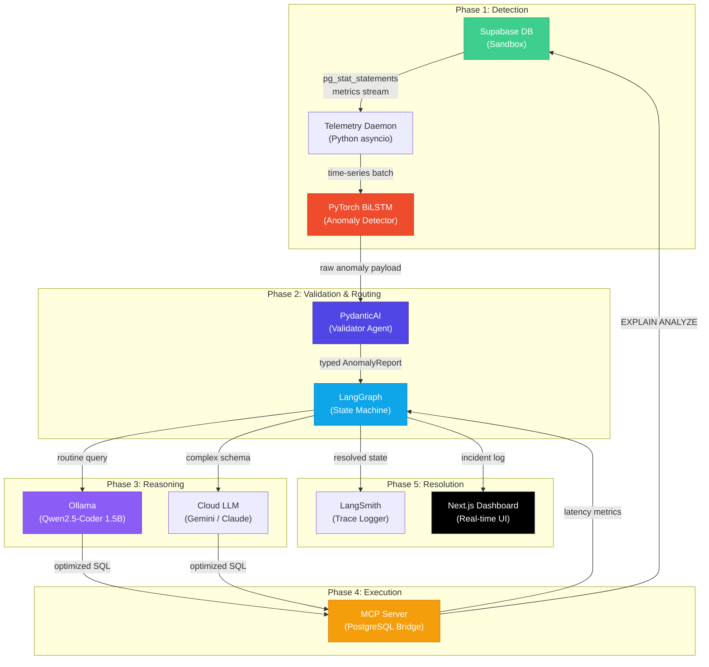
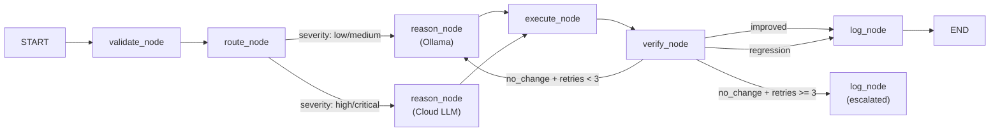

# Project Apex: Autonomous Database Performance Tuning & Guardrail Engine

An AIOps pipeline that monitors live database traffic via a PyTorch BiLSTM, validates anomaly payloads with PydanticAI, orchestrates multi-agent SQL optimization through LangGraph, rewrites queries locally via Ollama, executes safe dry-runs over MCP → Supabase, and surfaces everything through a Next.js real-time dashboard with LangSmith tracing.

---

## User Review Required

> [!IMPORTANT]
> **Hardware Confirmation:** The plan assumes an **RTX 3050 with 4GB VRAM**. If you have the **8GB variant**, we can use larger models (Qwen2.5-Coder 7B instead of 1.5B) and larger batch sizes. Please confirm.

> [!IMPORTANT]
> **Supabase Credentials:** We need a Supabase project URL and service-role key to set up the sandbox database, MCP bridge, and LangGraph checkpointer. Do you already have a Supabase project, or should we create one during setup?

> [!WARNING]
> **Dataset Downloads:** The three Kaggle datasets (NAB, Spider, SQL Practice 2) require a Kaggle account and API token (`~/.kaggle/kaggle.json`). Do you have this configured, or should we plan for manual download?

> [!IMPORTANT]
> **Ollama Pre-installation:** Ollama must be installed on your system before Phase 5. Confirm if it's already installed, or we'll include installation steps.

## Open Questions

1. **Cloud Escalation Model:** For complex multi-table schema migrations (Phase 2 routing), do you prefer **Gemini 2.0** or **Claude 3.5 Sonnet** as the escalation target? This affects which SDK we integrate (`google-genai` vs `anthropic`).
2. **LangSmith Tier:** Do you have a LangSmith account/API key, or should we plan for the free tier with limited trace retention?
3. **Frontend Framework:** The spec mentions "Next.js or Vue 3." This plan defaults to **Next.js 15** with App Router for the dashboard. Confirm or switch to Vue 3 + Vite.
4. **Python Version:** We'll target **Python 3.11+** for compatibility with all dependencies. Confirm your installed Python version.
5. **Spider Dataset Access:** The original Spider dataset requires accepting a license on the Yale website. The plan uses the HuggingFace mirror (`xlangai/spider`). Is that acceptable?

---

## Architecture Overview



---

## Project Structure

```
d:\CODES\Ongoing_Projects\ML_Project\
├── .env                              # All secrets (Supabase, LangSmith, Ollama, Kaggle)
├── .env.example                      # Template without secrets
├── pyproject.toml                    # Python project config (uv/pip)
├── requirements.txt                  # Pinned Python dependencies
├── README.md                         # Project documentation
│
├── data/                             # Dataset storage (gitignored)
│   ├── nab/                          # Numenta Anomaly Benchmark CSVs
│   ├── spider/                       # Spider Text-to-SQL JSON + databases
│   └── sql_practice/                 # SQL Practice Dataset 2 CSVs
│
├── scripts/                          # One-off setup & utility scripts
│   ├── download_datasets.py          # Kaggle API dataset downloader
│   ├── seed_supabase.py              # Load sql_practice data into Supabase
│   └── setup_supabase_schema.py      # Create tables, indexes, pg_stat views
│
├── src/                              # Core Python package
│   ├── __init__.py
│   │
│   ├── config/                       # Configuration management
│   │   ├── __init__.py
│   │   └── settings.py               # Pydantic Settings (env loader)
│   │
│   ├── models/                       # PyTorch models
│   │   ├── __init__.py
│   │   ├── bilstm.py                 # BiLSTM anomaly detector architecture
│   │   ├── dataset.py                # NAB time-series PyTorch Dataset
│   │   ├── train.py                  # Training loop with AMP + gradient accumulation
│   │   └── inference.py              # Real-time anomaly scoring
│   │
│   ├── telemetry/                    # Database metrics collection
│   │   ├── __init__.py
│   │   ├── collector.py              # Async Supabase metrics streamer
│   │   └── preprocessor.py           # Feature engineering for BiLSTM input
│   │
│   ├── validation/                   # PydanticAI validation layer
│   │   ├── __init__.py
│   │   ├── schemas.py                # Pydantic models (AnomalyReport, QueryContext, etc.)
│   │   └── validator_agent.py        # PydanticAI agent for payload validation
│   │
│   ├── orchestration/                # LangGraph state machine
│   │   ├── __init__.py
│   │   ├── state.py                  # TypedDict state definitions
│   │   ├── nodes.py                  # Graph node functions (validate, reason, execute, verify)
│   │   ├── graph.py                  # Graph compilation with Supabase checkpointer
│   │   └── router.py                 # Severity-based routing logic
│   │
│   ├── reasoning/                    # LLM reasoning layer
│   │   ├── __init__.py
│   │   ├── ollama_agent.py           # Ollama Qwen2.5-Coder integration
│   │   ├── cloud_agent.py            # Cloud LLM fallback (Gemini/Claude)
│   │   ├── sql_optimizer.py          # Query rewrite + index recommendation logic
│   │   └── prompts.py                # System/user prompt templates
│   │
│   ├── mcp/                          # Model Context Protocol bridge
│   │   ├── __init__.py
│   │   ├── server.py                 # MCP server (PostgreSQL tools)
│   │   └── tools.py                  # explain_analyze, execute_query, list_tables
│   │
│   └── observability/                # LangSmith integration
│       ├── __init__.py
│       └── tracer.py                 # Tracing setup + custom spans
│
├── daemon.py                         # Main entry point — background monitoring daemon
│
├── dashboard/                        # Next.js 15 frontend
│   ├── package.json
│   ├── next.config.js
│   ├── tailwind.config.js            # (only if user wants Tailwind)
│   │
│   ├── src/
│   │   ├── app/
│   │   │   ├── layout.tsx            # Root layout (dark theme, Inter font)
│   │   │   ├── page.tsx              # Main dashboard page
│   │   │   ├── globals.css           # Design tokens, animations
│   │   │   │
│   │   │   ├── incidents/
│   │   │   │   └── page.tsx          # Incident history table
│   │   │   │
│   │   │   └── api/
│   │   │       ├── incidents/
│   │   │       │   └── route.ts      # REST: fetch incidents from Supabase
│   │   │       ├── metrics/
│   │   │       │   └── route.ts      # REST: fetch telemetry metrics
│   │   │       └── stream/
│   │   │           └── route.ts      # SSE: real-time anomaly stream
│   │   │
│   │   ├── components/
│   │   │   ├── MetricsChart.tsx       # ECharts/Recharts time-series visualization
│   │   │   ├── IncidentCard.tsx       # Individual incident detail card
│   │   │   ├── IncidentTimeline.tsx   # Step-by-step resolution timeline
│   │   │   ├── StatusBadge.tsx        # Severity badge component
│   │   │   ├── QueryDiff.tsx          # Before/after SQL diff viewer
│   │   │   └── Sidebar.tsx            # Navigation sidebar
│   │   │
│   │   └── lib/
│   │       ├── supabase.ts            # Supabase JS client
│   │       └── types.ts              # TypeScript type definitions
│   │
│   └── public/
│       └── favicon.ico
│
└── tests/                            # Test suite
    ├── test_bilstm.py                # Model architecture + training tests
    ├── test_schemas.py               # Pydantic validation tests
    ├── test_graph.py                 # LangGraph flow tests
    ├── test_mcp.py                   # MCP tool execution tests
    └── conftest.py                   # Shared fixtures
```

---

## Proposed Changes

### Component 1: Project Scaffolding & Configuration

Foundation layer — environment configuration, dependency management, and secrets handling.

#### [NEW] [.env.example](file:///d:/CODES/Ongoing_Projects/ML_Project/.env.example)
Template file with all required environment variables:
- `SUPABASE_URL`, `SUPABASE_SERVICE_KEY`, `SUPABASE_DB_URL` (PostgreSQL connection string)
- `OLLAMA_BASE_URL` (default `http://localhost:11434`)
- `LANGSMITH_TRACING=true`, `LANGSMITH_API_KEY`, `LANGSMITH_PROJECT`
- `KAGGLE_USERNAME`, `KAGGLE_KEY`
- `CLOUD_LLM_PROVIDER` (gemini|claude), `CLOUD_LLM_API_KEY`
- `ANOMALY_THRESHOLD`, `BATCH_SIZE`, `LEARNING_RATE`

#### [NEW] [requirements.txt](file:///d:/CODES/Ongoing_Projects/ML_Project/requirements.txt)
Pinned dependencies organized by component:
```
# Core
python-dotenv>=1.0
pydantic>=2.7
pydantic-settings>=2.3

# Deep Learning
torch>=2.3.0
numpy>=1.26
pandas>=2.2
scikit-learn>=1.5

# AI/Agent Framework
langgraph>=0.4
langchain-core>=0.3
langchain-community>=0.3
langchain-ollama>=0.3
langgraph-checkpoint-postgres>=2.0
pydantic-ai>=0.1

# Database
supabase>=2.7
psycopg[binary]>=3.2
psycopg-pool>=3.2
asyncpg>=0.30

# MCP
mcp>=1.0

# Observability
langsmith>=0.2

# Utilities
httpx>=0.27
rich>=13.7
```

#### [NEW] [settings.py](file:///d:/CODES/Ongoing_Projects/ML_Project/src/config/settings.py)
Pydantic Settings class that loads from `.env` with validation:
- Type-safe access to all configuration
- Validation of required fields on startup
- Computed properties for derived URLs

---

### Component 2: Dataset Acquisition & Preparation

Scripts to download, validate, and prepare all three Kaggle datasets.

#### [NEW] [download_datasets.py](file:///d:/CODES/Ongoing_Projects/ML_Project/scripts/download_datasets.py)
- Uses `kaggle` CLI/API to download:
  - NAB: `numenta/nab` → `data/nab/`
  - Spider: `xlangai/spider` (HuggingFace) or Kaggle mirror → `data/spider/`
  - SQL Practice 2: specific Kaggle dataset slug → `data/sql_practice/`
- Validates file integrity after download
- Prints dataset statistics (row counts, file sizes)

#### [NEW] [seed_supabase.py](file:///d:/CODES/Ongoing_Projects/ML_Project/scripts/seed_supabase.py)
- Parses SQL Practice Dataset 2 CSVs
- Creates the food-delivery schema in Supabase:
  - `customers`, `restaurants`, `menu_items`, `orders`, `order_details`
- Bulk-inserts data via `psycopg` COPY protocol for speed
- Creates intentionally suboptimal queries for testing (missing indexes, sequential scans)
- Creates `apex_incidents` and `apex_metrics` tables for the dashboard

#### [NEW] [setup_supabase_schema.py](file:///d:/CODES/Ongoing_Projects/ML_Project/scripts/setup_supabase_schema.py)
- Enables `pg_stat_statements` extension
- Creates materialized views for query performance metrics
- Sets up RLS policies for MCP access
- Creates the LangGraph checkpointer tables

---

### Component 3: PyTorch BiLSTM Anomaly Detector

The core deep learning model trained on NAB telemetry data.

#### [NEW] [bilstm.py](file:///d:/CODES/Ongoing_Projects/ML_Project/src/models/bilstm.py)
Architecture designed for 4GB VRAM:
```python
class AnomalyBiLSTM(nn.Module):
    """
    Bidirectional LSTM for time-series anomaly detection.
    
    Architecture:
    - Input:  (batch, seq_len, features)  → seq_len=60, features=1
    - BiLSTM: 2 layers, hidden_size=64, dropout=0.3
    - FC:     128 → 64 → 1 (reconstruction error)
    
    Memory footprint: ~15MB parameters → fits easily in 4GB VRAM
    """
```
- Reconstruction-based anomaly detection (autoencoder style)
- Input: sliding windows of 60 timesteps
- Output: reconstruction error → threshold for anomaly flag
- Uses `nn.utils.rnn.pack_padded_sequence` for variable-length inputs

#### [NEW] [dataset.py](file:///d:/CODES/Ongoing_Projects/ML_Project/src/models/dataset.py)
- Custom `torch.utils.data.Dataset` for NAB CSV files
- Sliding window extraction with configurable `window_size` and `stride`
- Min-max normalization per-series
- Train/validation/test splits respecting temporal ordering (no data leakage)
- `pin_memory=True` DataLoader factory

#### [NEW] [train.py](file:///d:/CODES/Ongoing_Projects/ML_Project/src/models/train.py)
Training loop optimized for RTX 3050 (4GB VRAM):
- **Mixed Precision (AMP):** `torch.amp.autocast('cuda')` + `GradScaler`
- **Gradient Accumulation:** Effective batch size of 64 via 4 accumulation steps × batch_size=16
- **Early Stopping:** Patience of 10 epochs on validation loss
- **Checkpointing:** Save best model to `models/best_bilstm.pt`
- **Logging:** Rich progress bars + optional WandB/TensorBoard
- Training time estimate: ~15-30 minutes on NAB dataset

#### [NEW] [inference.py](file:///d:/CODES/Ongoing_Projects/ML_Project/src/models/inference.py)
- Loads trained model with `torch.no_grad()` context
- Real-time scoring: accepts a window of metrics, returns anomaly score + boolean flag
- Configurable threshold (default: mean + 3σ of training reconstruction errors)
- Batched inference for background daemon efficiency

---

### Component 4: Telemetry Collection Daemon

Async background service that streams database metrics into the BiLSTM.

#### [NEW] [collector.py](file:///d:/CODES/Ongoing_Projects/ML_Project/src/telemetry/collector.py)
- Async loop using `asyncpg` to poll `pg_stat_statements` every 5 seconds
- Collects: `total_exec_time`, `calls`, `rows`, `mean_exec_time`, `shared_blks_hit/read`
- Maintains a rolling buffer of the last 300 readings (25 minutes of history)
- Pushes windowed batches to the inference engine

#### [NEW] [preprocessor.py](file:///d:/CODES/Ongoing_Projects/ML_Project/src/telemetry/preprocessor.py)
- Feature engineering: computes rate-of-change, z-scores, ratio of sequential scans
- Normalizes features using statistics from training data
- Formats data into BiLSTM-compatible tensors

---

### Component 5: PydanticAI Validation Layer

Type-safe validation and structuring of anomaly payloads.

#### [NEW] [schemas.py](file:///d:/CODES/Ongoing_Projects/ML_Project/src/validation/schemas.py)
Pydantic v2 models:
```python
class AnomalyReport(BaseModel):
    anomaly_id: str = Field(default_factory=lambda: str(uuid4()))
    timestamp: datetime
    severity: Literal["low", "medium", "high", "critical"]
    anomaly_score: float = Field(ge=0.0, le=1.0)
    affected_query: str           # The slow SQL string
    table_names: list[str]        # Extracted table references
    baseline_exec_ms: float       # Normal execution time
    current_exec_ms: float        # Current (degraded) execution time
    degradation_factor: float     # current / baseline ratio
    source_metrics: dict          # Raw telemetry snapshot

class OptimizationResult(BaseModel):
    original_query: str
    optimized_query: str
    original_plan: dict           # EXPLAIN ANALYZE output
    optimized_plan: dict
    speedup_factor: float
    index_recommendations: list[str]
    status: Literal["improved", "no_change", "regression"]
```

#### [NEW] [validator_agent.py](file:///d:/CODES/Ongoing_Projects/ML_Project/src/validation/validator_agent.py)
- PydanticAI agent that receives raw anomaly data from the BiLSTM
- Extracts table names from SQL using regex + `sqlparse`
- Computes severity based on degradation factor thresholds
- Returns a validated `AnomalyReport` or raises `ValidationError`

---

### Component 6: LangGraph Orchestration Engine

The stateful brain that manages the entire incident lifecycle.

#### [NEW] [state.py](file:///d:/CODES/Ongoing_Projects/ML_Project/src/orchestration/state.py)
```python
class ApexState(TypedDict):
    anomaly_report: AnomalyReport        # From PydanticAI
    route: Literal["local", "cloud"]     # Routing decision
    optimized_query: Optional[str]       # From reasoning agent
    index_recommendations: list[str]     # From reasoning agent
    explain_before: Optional[dict]       # EXPLAIN ANALYZE original
    explain_after: Optional[dict]        # EXPLAIN ANALYZE optimized
    speedup_factor: Optional[float]      # Performance delta
    resolution: Literal["pending", "improved", "no_change", "escalated", "failed"]
    messages: list[BaseMessage]          # Conversation history
    retry_count: int                     # Loop guard
```

#### [NEW] [nodes.py](file:///d:/CODES/Ongoing_Projects/ML_Project/src/orchestration/nodes.py)
Graph node functions:
1. **`validate_node`**: Runs PydanticAI validator, populates `anomaly_report`
2. **`route_node`**: Evaluates severity → sets `route` to "local" or "cloud"
3. **`reason_node`**: Calls Ollama or cloud LLM to rewrite query
4. **`execute_node`**: Sends EXPLAIN ANALYZE via MCP, collects before/after plans
5. **`verify_node`**: Compares execution plans, computes speedup, sets resolution
6. **`log_node`**: Writes final incident to Supabase `apex_incidents` table

#### [NEW] [graph.py](file:///d:/CODES/Ongoing_Projects/ML_Project/src/orchestration/graph.py)
- Compiles the StateGraph with conditional edges
- Uses `PostgresSaver` checkpointer connected to Supabase
- Thread-based execution for concurrent incident handling
- Maximum 3 retry loops before marking as "failed"



#### [NEW] [router.py](file:///d:/CODES/Ongoing_Projects/ML_Project/src/orchestration/router.py)
- Severity thresholds:
  - `degradation_factor < 2.0` → low → local
  - `2.0 <= degradation_factor < 5.0` → medium → local
  - `5.0 <= degradation_factor < 10.0` → high → cloud
  - `degradation_factor >= 10.0` → critical → cloud

---

### Component 7: Reasoning Layer (Ollama + Cloud)

The intelligence that rewrites SQL and recommends indexes.

#### [NEW] [ollama_agent.py](file:///d:/CODES/Ongoing_Projects/ML_Project/src/reasoning/ollama_agent.py)
- Uses `langchain-ollama` (`ChatOllama`) with model `qwen2.5-coder:1.5b`
- Structured output via Pydantic schemas
- Temperature: 0.1 for deterministic SQL generation
- System prompt includes Spider-learned SQL patterns

#### [NEW] [cloud_agent.py](file:///d:/CODES/Ongoing_Projects/ML_Project/src/reasoning/cloud_agent.py)
- Fallback agent for complex schema migrations
- Supports both Gemini 2.0 (`langchain-google-genai`) and Claude 3.5 (`langchain-anthropic`)
- Same structured output schema as local agent for consistency

#### [NEW] [sql_optimizer.py](file:///d:/CODES/Ongoing_Projects/ML_Project/src/reasoning/sql_optimizer.py)
- Wraps the LLM call with pre/post processing
- Pre: formats schema context from `pg_catalog` introspection
- Post: validates generated SQL syntax with `sqlparse`
- Extracts index recommendations from LLM response

#### [NEW] [prompts.py](file:///d:/CODES/Ongoing_Projects/ML_Project/src/reasoning/prompts.py)
- Carefully engineered system prompts:
  - SQL optimization prompt with PostgreSQL-specific hints
  - Index recommendation prompt with cost-benefit analysis
  - Schema context formatting templates

---

### Component 8: MCP Server (PostgreSQL Bridge)

The secure execution layer between agents and the database.

#### [NEW] [server.py](file:///d:/CODES/Ongoing_Projects/ML_Project/src/mcp/server.py)
- MCP server using `mcp` Python SDK
- Stdio transport for local operation
- Connection pool to Supabase PostgreSQL via `psycopg_pool`

#### [NEW] [tools.py](file:///d:/CODES/Ongoing_Projects/ML_Project/src/mcp/tools.py)
Three registered MCP tools:
1. **`explain_analyze`**: Executes `EXPLAIN (ANALYZE, BUFFERS, FORMAT JSON)` on a query — read-only, safe
2. **`get_table_stats`**: Returns `pg_stat_user_tables` data for specified tables
3. **`list_slow_queries`**: Returns top-N slowest queries from `pg_stat_statements`

> [!IMPORTANT]
> All tools are **read-only by design**. No write operations are exposed through MCP to maintain the guardrail principle. The optimized queries are only tested via EXPLAIN ANALYZE (with actual execution for timing) but never committed.

---

### Component 9: LangSmith Observability

Full tracing of every agent decision and tool execution.

#### [NEW] [tracer.py](file:///d:/CODES/Ongoing_Projects/ML_Project/src/observability/tracer.py)
- Environment-based setup (reads `LANGSMITH_*` variables)
- Custom `@traceable` decorators for non-LangChain functions
- Metadata tagging: `incident_id`, `severity`, `model_used`
- Automatic cost tracking for cloud LLM calls

---

### Component 10: Background Daemon (Main Entry Point)

#### [NEW] [daemon.py](file:///d:/CODES/Ongoing_Projects/ML_Project/daemon.py)
The main orchestrator process:
1. Initializes settings, loads BiLSTM model
2. Starts async telemetry collector
3. On anomaly detection → creates LangGraph thread → invokes graph
4. Logs results to Supabase
5. Graceful shutdown handling (SIGINT/SIGTERM)
6. Health check endpoint for monitoring

---

### Component 11: Next.js Real-Time Dashboard

Premium monitoring interface with dark theme, real-time updates, and glassmorphism design.

#### [NEW] Dashboard — initialized via `npx create-next-app@latest`
- **Stack**: Next.js 15 (App Router) + TypeScript + Vanilla CSS
- **Data**: Supabase JS client for real-time subscriptions
- **Charts**: Recharts for time-series metrics visualization
- **Real-time**: Server-Sent Events (SSE) for live anomaly streaming

**Key Pages:**
| Route | Purpose |
|-------|---------|
| `/` | Main dashboard: live metrics chart, recent incidents, system status |
| `/incidents` | Full incident history with filtering, search, and SQL diff viewer |

**Key Components:**
| Component | Description |
|-----------|-------------|
| `MetricsChart` | Real-time CPU/latency/IO time-series with ECharts |
| `IncidentCard` | Glassmorphism card showing incident summary + severity badge |
| `IncidentTimeline` | Step-by-step resolution visualization (validate → reason → execute → verify) |
| `QueryDiff` | Side-by-side original vs. optimized SQL with syntax highlighting |
| `Sidebar` | Dark navigation with active state animations |

**Design System:**
- Dark mode primary (`#0a0a0f` background, `#1a1a2e` surfaces)
- Accent gradients: `#3ecf8e` (Supabase green) → `#0ea5e9` (info blue)
- Severity colors: `#22c55e` (low) → `#eab308` (medium) → `#f97316` (high) → `#ef4444` (critical)
- Inter font from Google Fonts
- Glassmorphism: `backdrop-filter: blur(16px)`, semi-transparent borders
- Micro-animations: fade-in on load, pulse on active incidents, smooth chart transitions

---

## Dependency Compatibility Matrix

| Package | Version | VRAM Impact | Notes |
|---------|---------|-------------|-------|
| `torch` | 2.3+ | ~1.5GB (model + training) | CUDA 12.1 compatible |
| `qwen2.5-coder:1.5b` | Q4_K_M | ~1.2GB | Via Ollama, coexists with PyTorch |
| `langgraph` | 0.4+ | None (CPU) | Requires `langchain-core` 0.3+ |
| `pydantic-ai` | 0.1+ | None (CPU) | Compatible with Pydantic v2 |
| `psycopg[binary]` | 3.2+ | None (CPU) | PostgreSQL 15+ driver |
| `mcp` | 1.0+ | None (CPU) | Python MCP SDK |

> [!WARNING]
> **VRAM Budget (4GB):** During the **monitoring phase** (inference only), the BiLSTM uses ~50MB and Ollama uses ~1.2GB, totaling ~1.3GB — well within limits. During **training**, the BiLSTM uses ~1.5GB and Ollama should NOT be running simultaneously. The training script will warn if Ollama is detected.

---

## Implementation Phases & Timeline

| Phase | Duration | Components | Deliverable |
|-------|----------|------------|-------------|
| **Phase A** | Day 1 | Scaffolding, Config, Dataset Download | Working project structure + data |
| **Phase B** | Day 2-3 | BiLSTM Model + Training Pipeline | Trained anomaly detector |
| **Phase C** | Day 3-4 | Supabase Setup + Telemetry Daemon | Live metrics streaming |
| **Phase D** | Day 4-5 | PydanticAI + LangGraph + Routing | Stateful orchestration pipeline |
| **Phase E** | Day 5-6 | Ollama + Cloud Agent + MCP Server | End-to-end reasoning + execution |
| **Phase F** | Day 6-7 | LangSmith + Dashboard | Full observability + visualization |
| **Phase G** | Day 7 | Integration Testing + Polish | Production-ready system |

---

## Verification Plan

### Automated Tests
```bash
# Run full test suite
python -m pytest tests/ -v --tb=short

# Specific component tests
python -m pytest tests/test_bilstm.py -v          # Model trains and converges
python -m pytest tests/test_schemas.py -v          # Pydantic validation works
python -m pytest tests/test_graph.py -v            # LangGraph flow completes
python -m pytest tests/test_mcp.py -v              # MCP tools return valid data
```

### Integration Verification
1. **BiLSTM Training:** Verify training loss decreases monotonically, validation AUC > 0.85 on NAB test split
2. **End-to-End Flow:** Inject a synthetic anomaly (simulated slow query) → verify it flows through all 5 phases → check incident appears in Supabase `apex_incidents`
3. **MCP Safety:** Confirm that only `EXPLAIN ANALYZE` is executed, no data mutation occurs
4. **Dashboard:** Start Next.js dev server → verify real-time chart updates, incident cards render, SQL diff displays correctly
5. **VRAM Monitoring:** Run `nvidia-smi` during inference to confirm < 2GB usage
6. **LangSmith:** Verify traces appear in dashboard with correct metadata and latency measurements

### Manual Verification
- Review LangSmith trace dashboard for complete agent execution visibility
- Visually inspect the Next.js dashboard for design quality and responsiveness
- Trigger a real slow query on Supabase and watch the full pipeline execute
